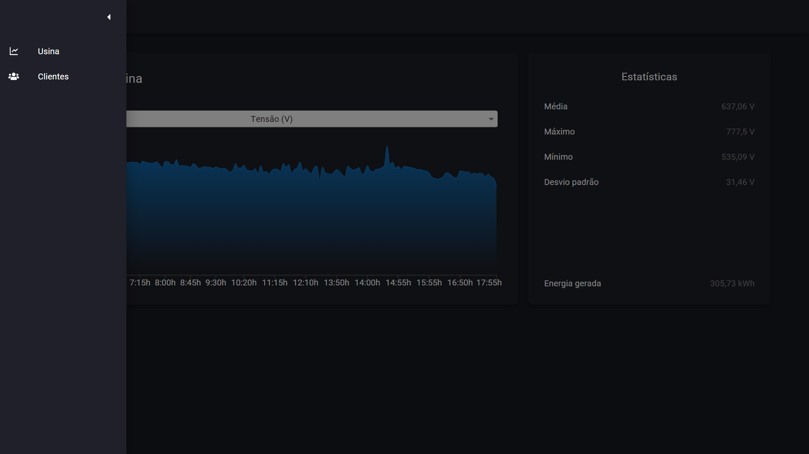
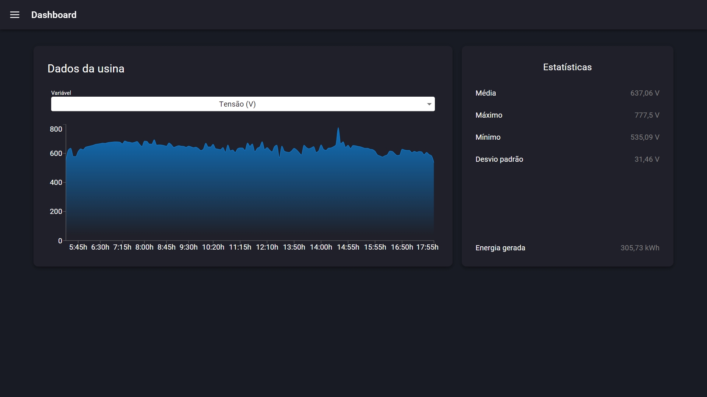
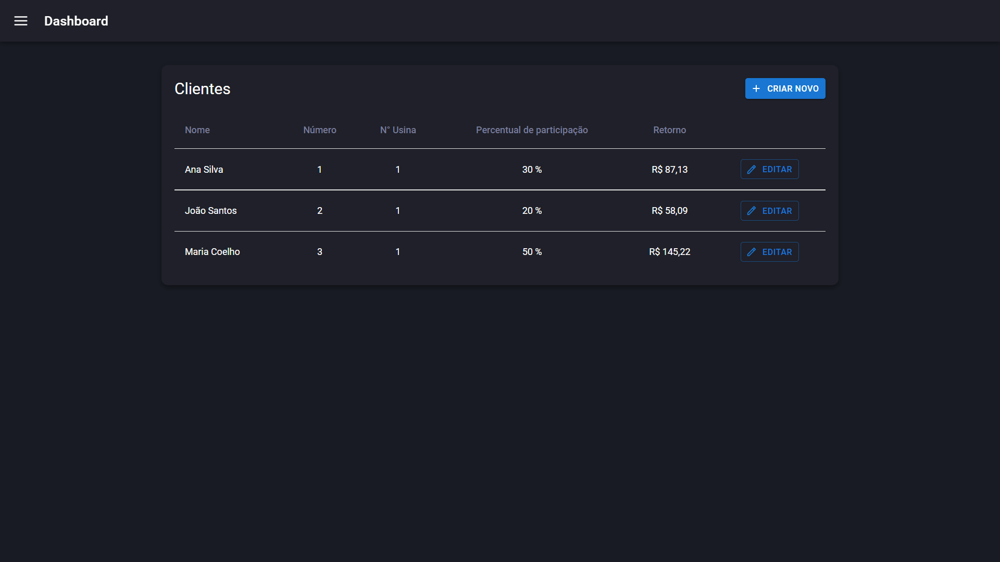
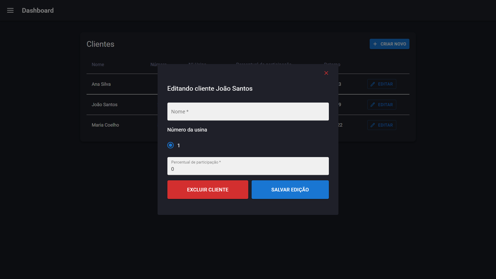
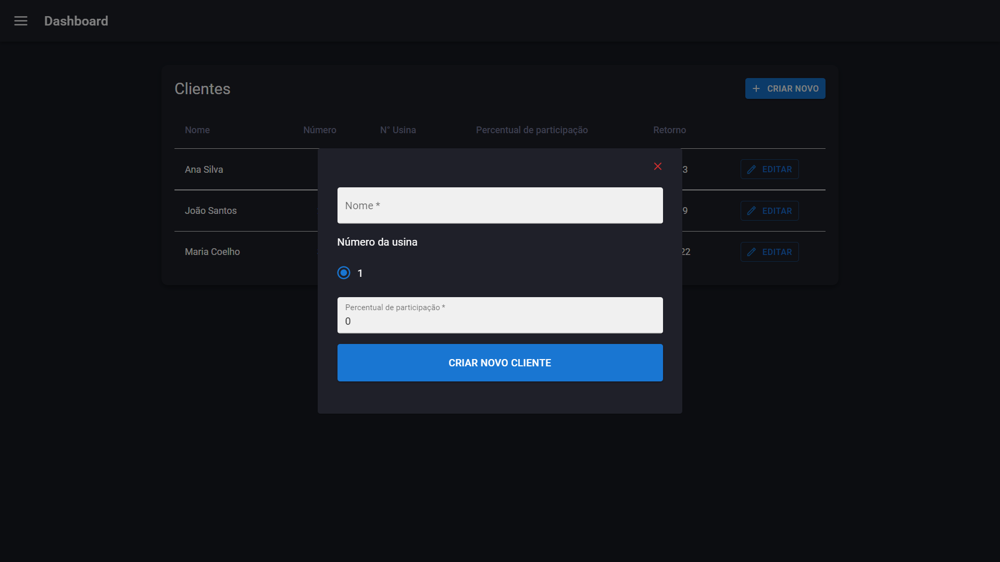

# Desafio do processo seletivo SHARENERGY 2021/22

Essa aplicação foi desenvolvida para o processo seletivo da SHARENERGY 2021/22.

Vídeo de explicação do projeto: [Projeto do desafio](https://youtu.be/YUUBrJp6Dxo)

## A aplicação

O projeto consiste em um dashboard que dispõe os dados de um dia de produção de uma usina fotovoltaica e os dados dos clientes investidores dessa usina. Além da possibilidade de inserir, editar e excluir clientes.

### Tecnologias utilizadas

- [React](https://pt-br.reactjs.org/)
- [React-router-dom](https://v5.reactrouter.com/web/guides/quick-start)
- [TypeScript](https://www.typescriptlang.org/)
- [Material UI](https://mui.com/pt/)
- [Recharts](https://recharts.org/en-US/)
- [Json-server](https://github.com/typicode/json-server)

## Inicializando o servidor

Os dados da usina e dos clientes, que antes consistiam em dois arquivos chamados "dadosUsina.json" e "dadosClientes.json", respectivamente, foram transformados em apenas um arquivo chamado "server.json", que se encontra na raiz do projeto. Sendo assim, utilizando o json-server, foi criado uma Fake API a partir do arquivo "[server.json](server.json)".

Para iniciar o servidor rode o comando "npm run server", então os dados estarão disponíveis na rota "http://localhost:3333".

Os dados da usina podem ser acessados na rota "http://localhost:3333/dadosUsina".

Já os dados dos clientes se encontram na rota "http://localhost:3333/dadosClientes".

## Rodando a aplicação

Após inicializar o servidor, abra outro terminal e rode o comando "npm run dev". Logo após rodar o comando, a aplicação estará disponível em "http://localhost:3000"

## Navegando pela aplicação

A aplicação possui apenas duas páginas, uma apresenta o gráfico com os dados da usina e a outra uma tabela com os dados de todos os clientes, podendo ser feita a navegação através do barra lateral, como mostra a imagem:

### Página Usina (home)

Na página inicial se encontra o gráfico dos dados da usina e as estatísticas descritivas dos dados do gráfico.

o Gráfico apresenta os dados de uma variável em funcão do tempo. Por padrão, a variável inicial será a tensão (V), sendo possível alterar esta variável por outra disponível na lista suspensa, como mostra a imagem abaixo.

### Página Clientes

Nesta página é possível analisar os dados dos clientes, que são:

- número de identificação do cliente investidor
- número da usina em que o cliente investe
- percentual de participação do cliente
- retorno financeiro

Ao clicar em "Editar", será aberto um modal onde é possível editar os dados do cliente, como na imagem abaixo.

E ao clicar em "Criar novo", será aberto outro modal onde é possível criar um novo cliente.

